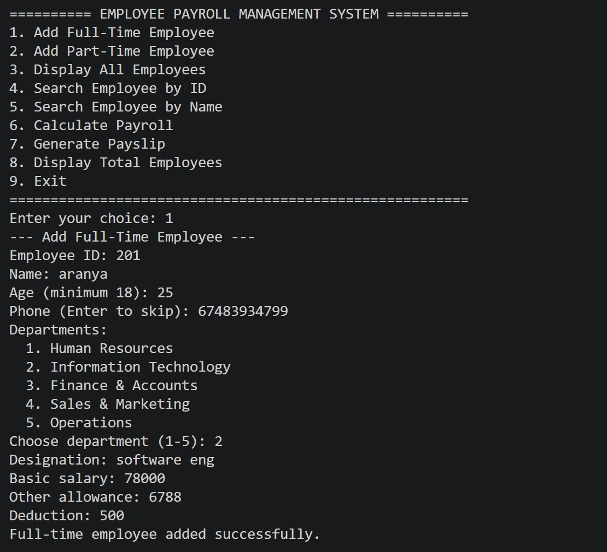
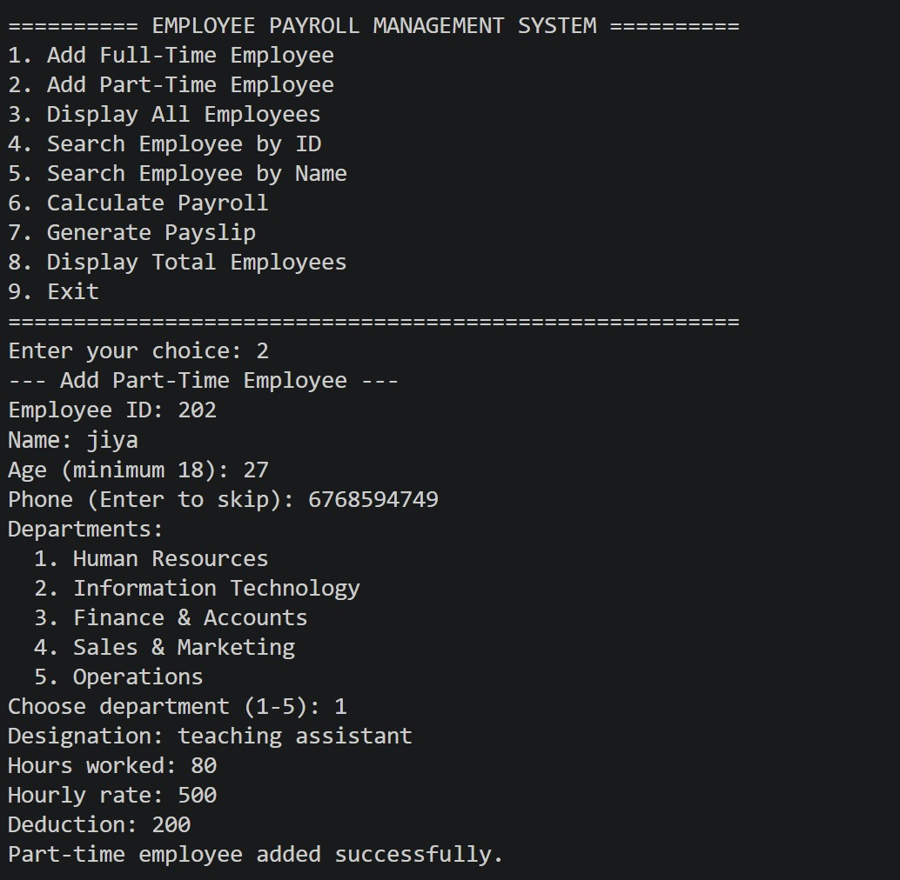
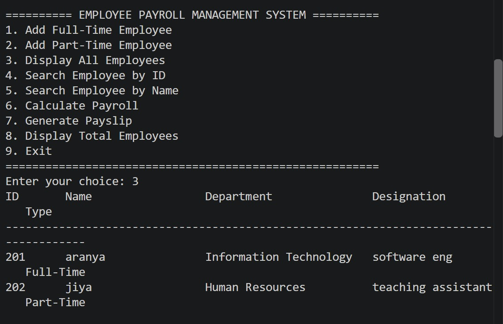
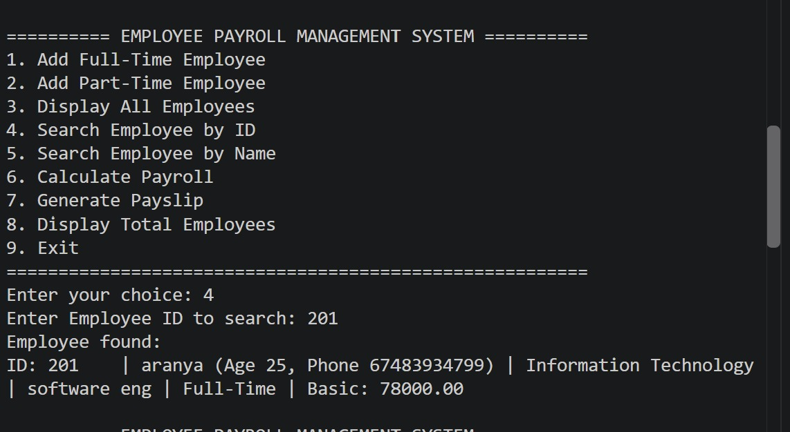
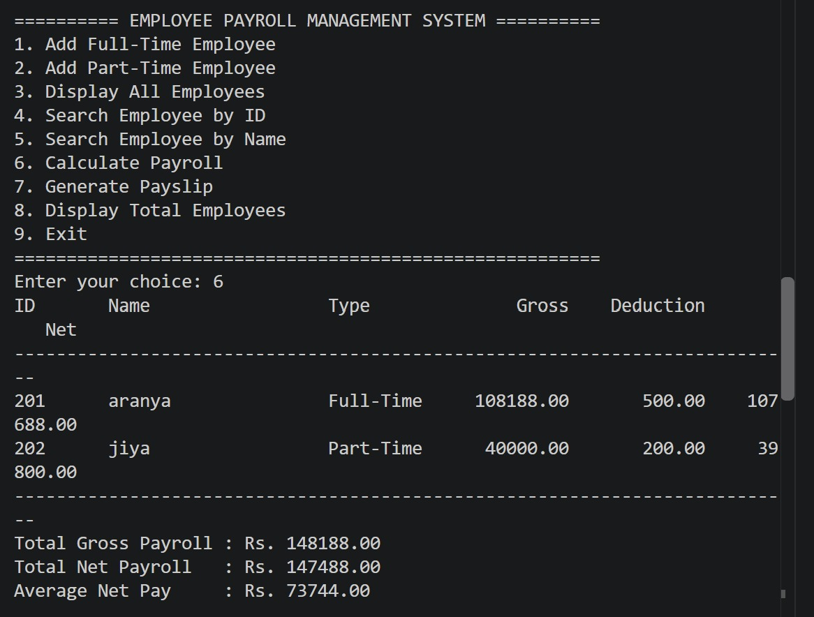
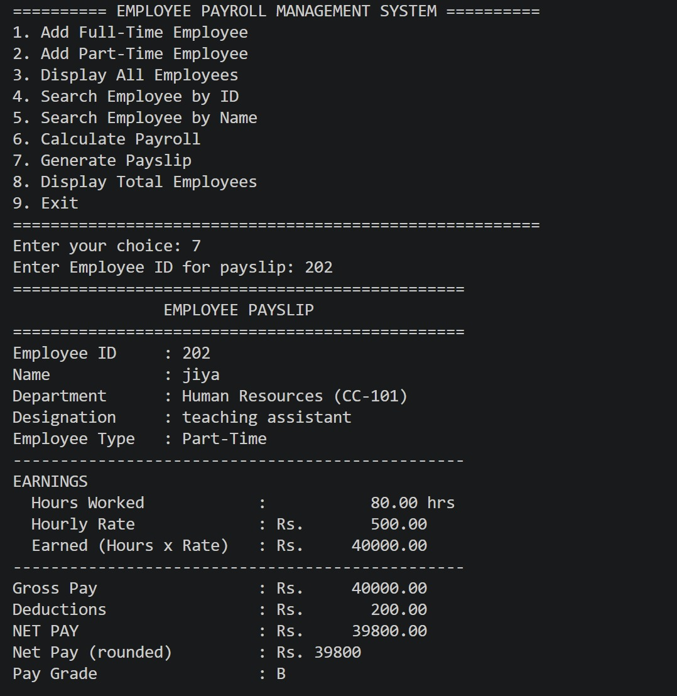
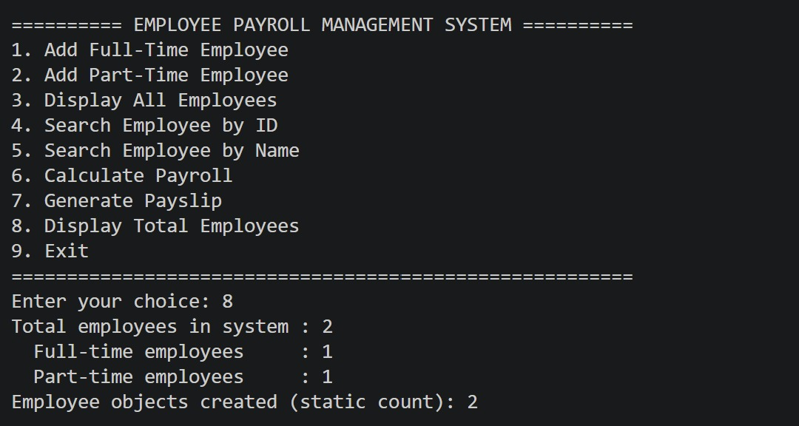
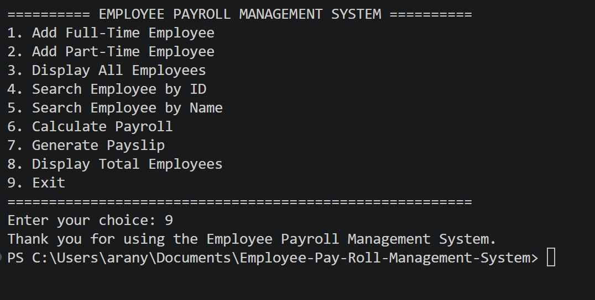
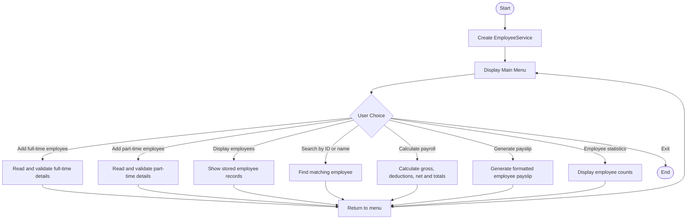
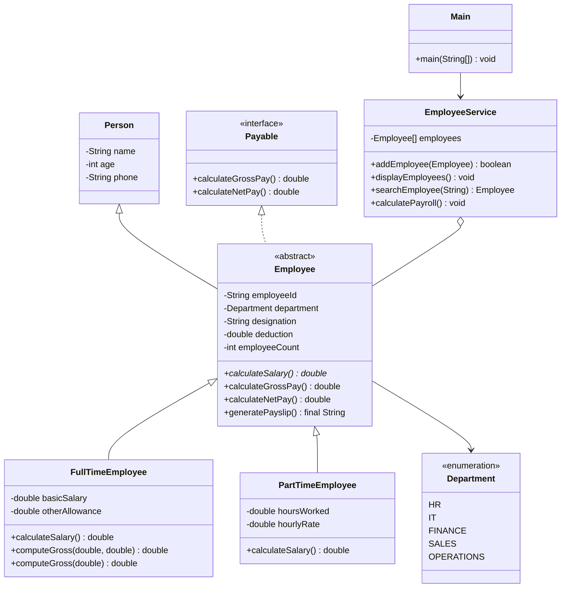

# Employee Payroll Management System

### Java Programming Mini Project · REVA University

<p align="center">
  <strong>B.Sc. (BSTCs) · Semester V · Java Programming</strong><br>
  Employee Payroll Management System
</p>

<p align="center">
  A menu-driven Java console application for managing full-time and part-time employee records, calculating payroll, searching employees, and generating formatted payslips while demonstrating core object-oriented programming concepts.
</p>

---

## Project Overview

The **Employee Payroll Management System** is a console-based Java application that simulates basic employee and payroll operations. It allows users to register full-time and part-time employees, display employee records, search by employee ID or name, calculate payroll totals, and generate formatted payslips.

The project demonstrates core Java and object-oriented programming (OOP) concepts, including encapsulation, multilevel inheritance, abstraction, polymorphism, interfaces, method and constructor overloading, method overriding, static members, enumerations, arrays of objects, type conversion, and custom packages.

The application is organised into three custom packages: `com.college.model`, `com.college.service`, and `com.college.app`. Employee records are stored in an array while the program is running. Database or persistent file storage is not implemented.

## Features

| Feature | Description |
|---|---|
| Full-time employee registration | Adds full-time employees with personal details, department, designation, basic salary, allowances, and deductions. |
| Part-time employee registration | Adds part-time employees with personal details, department, designation, hours worked, hourly rate, and deductions. |
| Employee listing | Displays the employees currently stored in the application. |
| Search by employee ID | Searches for an employee using an exact ID match. |
| Search by employee name | Searches using a full or partial name, ignoring letter case. |
| Payroll report | Calculates gross pay, deductions, net pay, total payroll, and average net pay. |
| Payslip generation | Produces a formatted payslip for an employee. |
| Employee statistics | Displays the stored employee count and the static employee-object counter. |
| Department handling | Uses a `Department` enum for Human Resources, Information Technology, Finance, Sales, and Operations, with display names and cost-centre codes. |
| Input validation | Checks required text, duplicate IDs, age, numeric input, salary-related values, deductions, and menu choices. |
| OOP demonstrations | Uses an abstract employee class, inheritance, an interface, method overriding, overloading, and dynamic binding. |

## Application Screenshots

The following screenshots were captured from the Employee Payroll Management System running in the terminal. They show the employee registration, listing, searching, payroll, payslip, statistics, and exit features.

<table>
  <tr>
    <td width="50%" valign="top">
      <h3>01 · Add Full-Time Employee</h3>
      
    </td>
    <td width="50%" valign="top">
      <h3>02 · Add Part-Time Employee</h3>
      
    </td>
  </tr>
  <tr>
    <td width="50%" valign="top">
      <h3>03 · Display Employees</h3>
      
    </td>
    <td width="50%" valign="top">
      <h3>04 · Search by Employee ID</h3>
      
    </td>
  </tr>
  <tr>
    <td width="50%" valign="top">
      <h3>05 · Payroll Report</h3>
      
    </td>
    <td width="50%" valign="top">
      <h3>06 · Part-Time Employee Payslip</h3>
      
    </td>
  </tr>
  <tr>
    <td width="50%" valign="top">
      <h3>07 · Employee Statistics</h3>
      
    </td>
    <td width="50%" valign="top">
      <h3>08 · Exit Program</h3>
      
    </td>
  </tr>
</table>

## Data Flow Diagram

The following flowchart summarises the application's menu-driven workflow.



## UML Class Structure

The following Mermaid class diagram summarises the main classes, interface, and inheritance relationships in the project.



## Project Structure

```text
EmployeePayrollManagement/
├── README.md
├── SAMPLE_OUTPUT.txt
├── VIVA_QA.md
├── run.bat
├── .gitignore
├── screenshots/
│   ├── 01_main_menu.png
│   ├── 02_add_full_time.png
│   ├── 03_add_part_time.png
│   ├── 04_display_employees.png
│   ├── 05_search_by_id.png
│   ├── 06_search_by_name.png
│   ├── 07_calculate_payroll.png
│   ├── 08_full_time_payslip.png
│   ├── 09_part_time_payslip.png
│   ├── 10_employee_totals.png
│   └── 11_exit.png
└── src/
    └── com/
        └── college/
            ├── app/
            │   └── Main.java
            ├── model/
            │   ├── Person.java
            │   ├── Employee.java
            │   ├── FullTimeEmployee.java
            │   ├── PartTimeEmployee.java
            │   ├── Department.java
            │   └── Payable.java
            └── service/
                └── EmployeeService.java
```

## Object-Oriented Programming Concepts Demonstrated

| Concept / Requirement | Project implementation |
|---|---|
| Encapsulation | Private fields and getters/setters in model classes; validation is applied through relevant setters and input methods. |
| Data types and variable scope | Uses `String`, `int`, `double`, `char`, and `boolean`, including instance, local, and static variables. |
| Constants and `final` | Uses constants such as `MIN_AGE`, HRA/DA rates, maximum employee capacity, and currency; `generatePayslip()` is final. |
| Operators and precedence | Arithmetic and comparison operators are used in salary calculations, deductions, validation, and pay-grade logic. |
| Type conversion | Explicit conversion and numeric promotion are used in payroll calculations and payslip formatting. |
| Enumerations | `Department` defines HR, IT, Finance, Sales, and Operations with display names and cost-centre codes. |
| Control flow | `if-else`, `switch`, `for`, `while`, enhanced `for`, and `do-while` are used in menus and record processing. |
| Jump statements | `break`, `continue`, and `return` are used in loops and methods. |
| Arrays of objects | `EmployeeService` stores employees in an `Employee[]` array with a maximum capacity of 100. |
| Console I/O and formatting | `Scanner`, `System.out.printf()`, and `String.format()` support input and formatted output. |
| Constructor overloading | Model classes provide multiple constructors, including shorter constructors that delegate to other constructors. |
| Method overloading | `EmployeeService.searchEmployee()` and `FullTimeEmployee.computeGross()` have overloaded forms. |
| Static members | `Employee` maintains a static employee-object counter exposed through `getEmployeeCount()`. |
| `this` keyword | Used for field/parameter disambiguation and constructor chaining. |
| String methods | `trim()`, `equalsIgnoreCase()`, `contains()`, `toLowerCase()`, `toUpperCase()`, and `isEmpty()` support validation and searching. |
| Inheritance | `Person` is extended by `Employee`, which is extended by `FullTimeEmployee` and `PartTimeEmployee`. |
| `super` keyword | Used to call parent constructors and reuse parent-class methods. |
| Overriding and dynamic binding | Full-time and part-time employee classes override employee methods; runtime dispatch selects the implementation for the actual object. |
| Abstract class and method | `Employee` is abstract and declares `calculateSalary()` for subclasses to implement. |
| Interface | `Employee` implements `Payable`, which defines gross-pay and net-pay operations. |
| Object method overriding | `toString()`, `equals(Object)`, and `hashCode()` are implemented for display and duplicate handling. |
| Custom packages | The source is divided into `com.college.model`, `com.college.service`, and `com.college.app`. |

## Important Source Files

- **Application entry point:** [`Main.java`](src/com/college/app/Main.java)
- **Person base class:** [`Person.java`](src/com/college/model/Person.java)
- **Abstract employee and shared payroll logic:** [`Employee.java`](src/com/college/model/Employee.java)
- **Full-time employee salary calculation:** [`FullTimeEmployee.java`](src/com/college/model/FullTimeEmployee.java)
- **Part-time employee salary calculation:** [`PartTimeEmployee.java`](src/com/college/model/PartTimeEmployee.java)
- **Department enumeration:** [`Department.java`](src/com/college/model/Department.java)
- **Payroll interface:** [`Payable.java`](src/com/college/model/Payable.java)
- **Employee management operations:** [`EmployeeService.java`](src/com/college/service/EmployeeService.java)
- **Sample console run:** [`SAMPLE_OUTPUT.txt`](SAMPLE_OUTPUT.txt)
- **Viva preparation:** [`VIVA_QA.md`](VIVA_QA.md)

## Compile and Run

The project uses standard Java source files and does not require a database or external libraries. Install a compatible JDK and run the commands from the project root.

### Windows

You can run `run.bat` from the extracted project folder, or use PowerShell:

```powershell
cd EmployeePayrollManagement
javac -d out src\com\college\model\*.java src\com\college\service\*.java src\com\college\app\Main.java
java -cp out com.college.app.Main
```

### macOS / Linux / Git Bash

Run these commands from the project root:

```bash
mkdir -p out
javac -d out src/com/college/model/*.java src/com/college/service/*.java src/com/college/app/Main.java
java -cp out com.college.app.Main
```

### Visual Studio Code

1. Extract the ZIP file.
2. Open the extracted `EmployeePayrollManagement` folder in VS Code.
3. Install the **Extension Pack for Java** if it is not already installed.
4. Open `src/com/college/app/Main.java`.
5. Click **Run**, or use the configured Run and Debug option.
6. Follow the console prompts to test each menu option.

Employee records are held in memory for the current run. They are not automatically saved after the application exits.

## Sample Console Output

A full sample run is provided in [`SAMPLE_OUTPUT.txt`](SAMPLE_OUTPUT.txt). It demonstrates adding full-time and part-time employees, listing records, searching, calculating payroll, generating payslips, displaying employee statistics, and exiting the application.

An excerpt from the documented sample payroll report is shown below:

```text
Enter your choice: 6
ID       Name                 Type              Gross    Deduction          Net
E101     Rahul Sharma         Full-Time      70000.00      4000.00     66000.00
P201     Meena Iyer           Part-Time      20000.00      1000.00     19000.00
Total Gross Payroll : Rs. 90000.00
Total Net Payroll   : Rs. 85000.00
Average Net Pay     : Rs. 42500.00
```

## Submission Checklist

- [x] Java source organised into custom packages
- [x] Full-time and part-time employee registration
- [x] Employee listing and searching by ID or name
- [x] Payroll calculations and payroll summary
- [x] Formatted employee payslips
- [x] Department enum and cost-centre handling
- [x] OOP concepts mapped to source files
- [x] UML class diagram included
- [x] Data flow diagram included
- [x] Compile and execution instructions included
- [x] Sample console output included
- [x] Eight genuine program screenshots added to the `screenshots/` folder and referenced above
- [x] Viva preparation document included

---

<p align="center">
  <sub>Java Programming Mini Project · REVA University · B.Sc. (BSTCs), Semester V</sub>
</p>
